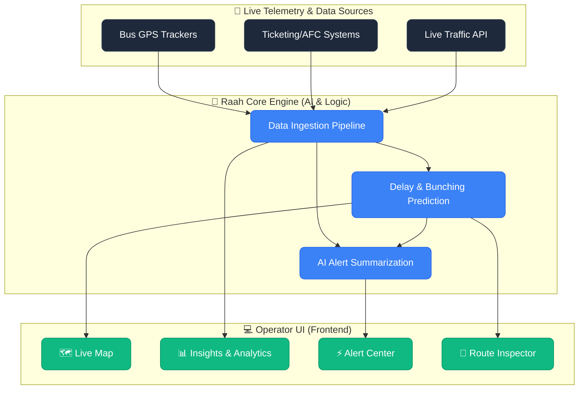

# 🚌 Raah: Reimagining Public Transit Operations

> *Every day, millions rely on public transit. But behind the scenes, transit operators fight a chaotic battle against traffic, bus bunching, and unexpected delays. What if they had a co-pilot?*

Enter **Raah** — a next-generation Mission Control dashboard for modern transit operators.

---

## 📖 The Story

In a sprawling metropolis, commuters wait anxiously at crowded bus stops. Suddenly, three buses arrive at once—a phenomenon known as **"Bus Bunching"**. The result? Overcrowded vehicles, wasted fuel, and furious riders. 

Traditionally, operators relied on clunky, fragmented systems to monitor their fleets. They were constantly reacting to problems instead of preventing them, buried under raw data without actionable insights.

**Raah** changes the narrative. By combining real-time telemetry, AI-driven insights, and intuitive design, Raah empowers operators to see the future of their fleet and intervene before bottlenecks snowball into network-wide delays.

---

## 🏗️ System Architecture

How does Raah work? It operates as the central nervous system for the city's transit network, processing chaos into clarity.



### 1. Data Ingestion (The Eyes & Ears)
Raah continuously ingests real-time GPS pings from the fleet, passenger loads from ticketing systems, and external factors like live traffic conditions.

### 2. The Core Engine (The Brain)
Our AI model doesn't just display data; it understands it. It detects patterns, predicts where bunching is most likely to occur, and generates plain-english summaries for the operators (e.g., *"Accident on Route 101 causing a 12-min delay. Recommend holding Bus #402 at the next stop."*).

### 3. Mission Control (The Hands)
The frontend dashboard—built with Next.js and TailwindCSS—visualizes the complexity into actionable, beautifully designed interfaces, giving operators the exact tools they need.

---

## ✨ Features

- 🗺️ **Live Map:** A gorgeous, real-time spatial view of the city. Filter by routes, stops, and traffic density.
- 🚌 **Route Inspector:** Dive deep into specific routes. See a simulated **"With Raah vs Without Raah"** comparison demonstrating how our pacing algorithms prevent bus bunching.
- ⚡ **Alert Center:** Drowning in notifications? Raah categorizes alerts (Critical/Warning) and provides actionable AI summaries. With a single click, operators can *Approve* or *Reject* interventions, tracking their decisions in a historical log.
- 📊 **Insights:** Dynamic charts showing daily ridership trends, delay heatmaps, and route health scores with customizable time filters. 

---

## 🚀 Getting Started

Want to spin up Raah Mission Control on your local machine? It's just a few commands away.

### Prerequisites
- Node.js (v18+)
- npm, yarn, or pnpm

### Installation

1. **Clone the repo**
   ```bash
   git clone https://github.com/Prince-Vaviya/raah-op.git
   cd raah-op
   ```

2. **Install dependencies**
   ```bash
   npm install
   ```

3. **Start the engines**
   ```bash
   npm run dev
   ```

4. **Take control**
   Open [http://localhost:3000](http://localhost:3000) in your browser and step into the shoes of a modern transit operator!

---

*Built with Next.js, TailwindCSS, Recharts, and Lucide Icons.*
